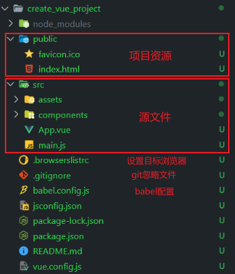

# 安装脚手架
  npm i @vue/cli -g


# 更新脚手架
  npm update @vue/cli -g


# 创建项目 
  veu create 项目名称

```js
? Please pick a preset: // 选择预设
  simpleSet ([Vue 3] babel, router) 
  Default ([Vue 3] babel, eslint)
  Default ([Vue 2] babel, eslint)
  Manually select features // 自定义
```

```js
? Please pick a preset: Manually select features
? Check the features needed for your project: (Press <space> to select, <a> to toggle all, <i> to invert selection, and <enter> to proceed)
 (*) Babel	// 是否选择babel
 ( ) TypeScript	// 是否使用ts
 ( ) Progressive Web App (PWA) Support	// 项目是否支持pwa
 ( ) Router	// 是否默认添加路由
 ( ) Vuex	// 是否默认添加状态管理
 ( ) CSS Pre-processors	// 是否选择css预处理器
 ( ) Linter / Formatter	// 是否选择ESLint对代码格式化限制
 ( ) Unit Testing	// 是否添加单元测试
>( ) E2E Testing	// 是否E2E测试
```

```js
? Choose a version of Vue.js that you want to start the project with (Use arrow keys)
> 3.x
  2.x
```

```js
? Where do you prefer placing config for Babel, ESLint, etc.? (Use arrow keys)
> In dedicated config files	 // 将配置信息放到独立文件
  In package.json	// 将配置信息放到package.json
```

```js
? Save this as a preset for future projects? (y/N)  // 是否将预设保存 
```

```js
? Pick the package manager to use when installing dependencies: 
  Use Yarn
> Use NPM
```


# 项目结构




.browserslistrc 文件

```js
> 1%   // 对市场份额大于1%的浏览器进行适配
last 2 versions  // 最后两个版本
not dead	// 不是最后版本
not ie 11
```

其他写法 https://github.com/browserslist/browserslist
